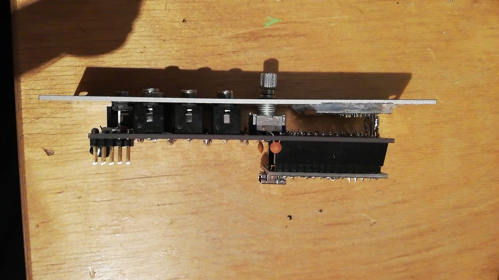
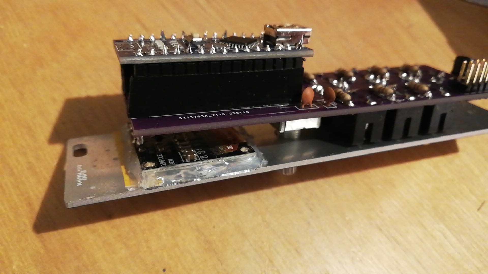

# HAGIWO 6 Channel Sequencer / Euclidean Rythm Sequencer

This project is a through hole PCB version the HAGIWO 009 [six channel gate sequencer](https://www.youtube.com/watch?v=YszdC8YdFl0&t=29s) and 030 [euclidean rythm sequencer](https://www.youtube.com/watch?v=lkoBfiq6KPY) eurorack synth modules. the modules run on an Arduino Nano and uses a [0.96 inch Oled I2C Display](https://www.ebay.de/itm/255303518853). The exact brand is not important, just make sure it is 128/64 pixels and has an DDS1306 driver.

Since both modules use the same hardware, I made it so that the panel pcb is flippable to reflect both functions.

## PCB and Hardware

You can find the BOM in the root folder.
For the PCBs, the module has one circuit PCB and one panel PCB. 
You can order them on any common PCB manufacturing service, I used [JLCPCB](https://jlcpcb.com/).
Standard settings should be fine.

## Assembly Instructions

The PCB is relatively simple to build, all the components are through-hole soldering.
It is easiest to start first with the resistors and capacitors, then the headers, and then the jacks at the end.

The only thing that is a bit tricky is the screen, since depending on your components it can stand out on the top. 
To prevent this, you can try soldering the display directly on the PCB.

Another optional but good idea is gluing the screen to the panel first before mounting to ensure it is positioned directly behind the cutout.

## Arduino Code and Testing

There are three Arduino files included in this project:
- The project file for the six channel drum sequencer (six_channel.ino)
- The project file for the euclidean sequencer        (euclidean.ino)
- A file for testing in/outputs to make sure you soldered everything correctly (test_circuit.ino). This file prints to the serial to test inputs and sets the digital outputs.

You need the [Adafruit_SSD1306](https://www.arduino.cc/reference/en/libraries/adafruit-ssd1306/) and [encoder](https://www.arduino.cc/reference/en/libraries/encoder/) libraries.
I also changed it such that is uses DigitalReadFast instead of DigitalRead (to recude latency, which was probably not a concern in the first place but I do it in all my arduino projects). See the [DigitalReadFast](https://github.com/NicksonYap/digitalWriteFast) repo.

One important change from HAGIWO's code is the introduction of the parameter ENCODER_COUNT_PER_ROTATION. 
Rotation encoders come in different versions, some have one click per rotation, some have two, others even have four. If you see multiple messages during a single turn while running the test_circuit file, set this parameter higher in all files before uploading.

