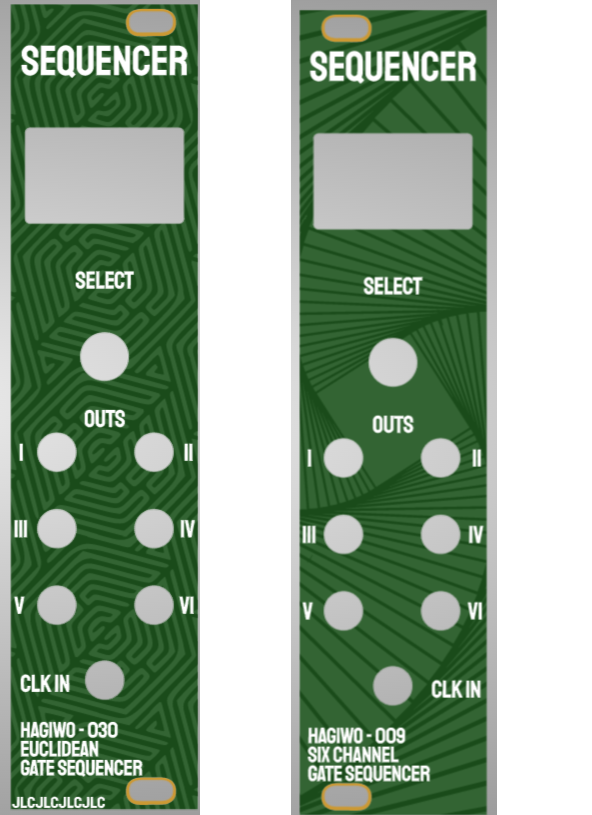

# HAGIWO 6 Channel Sequencer / Euclidean Rhythm Sequencer

This project is a through hole PCB version the HAGIWO 009 [six channel gate sequencer](https://www.youtube.com/watch?v=YszdC8YdFl0&t=29s) and 030 [euclidean rythm sequencer](https://www.youtube.com/watch?v=lkoBfiq6KPY) eurorack synth modules. the modules run on an Arduino Nano and uses a [0.96 inch Oled I2C Display](https://www.ebay.de/itm/255303518853). The exact brand is not important, just make sure it is 128/64 pixels and has an SSD1306 driver.
Also, pinout should match the one specified on the PCB:
I saw that there are some modules that have VCC-GND-SCL-SDA, but we need GND-VCC-SCL-SDA

Since both modules use the same hardware, I made it so that the panel pcb is flippable to reflect both functions.

## PCB and Hardware

You can find the schematic and BOM in the root folder.
For the PCBs, the module has one circuit PCB and one panel PCB. 
You can order them on any common PCB manufacturing service, I used [JLCPCB](https://jlcpcb.com/).
Standard settings should be fine, but if you have exposed copper on the panel you should go with a lead free surface finish (ENIG/Leadfree HASL).

If the panel sizes are not recognized correctly (may happen with my export sometimes) just put 128.5x30.

Use the panel_pcb.zip gerbers if you want a panel with exposed solder mask (so silver letters for title) but then make sure to choose a lead free finish cause health reasons.
If you don't want that, use the "panel_no_silver.zip" version.

The panel PCB is switchable to reflect the function depending on the firmware you want to use.    

    
    
## Assembly Instructions

The PCB is relatively simple to build, all the components are through-hole soldering.
It is easiest to start first with the resistors and capacitors, then the headers, and then the jacks at the end.    

The only thing that is a bit tricky is the screen, since depending on your components it can stand out on the top. 
To prevent this, you can try soldering the display directly on the PCB.    

Another optional but good idea is glueing the screen to the panel first before mounting to ensure it is positioned directly behind the cutout.
Downside to glueing is obviously not being able to flip the panel when flashing the firmware so only do it if you build two or are sure you dont need the other side of the panel.

## Arduino Code and Testing

There are three Arduino files included in this project:
- The project file for the six channel drum sequencer (six_channel_sequencer.ino)
- The project file for the euclidean sequencer        (euclid_sequencer.ino)
- A file for testing in/outputs to make sure you soldered everything correctly (test_circuit.ino). This file prints to the serial to test inputs and sets the digital outputs.

You need the [Adafruit_SSD1306](https://www.arduino.cc/reference/en/libraries/adafruit-ssd1306/) and [encoder](https://www.arduino.cc/reference/en/libraries/encoder/) libraries.
I also changed it such that is uses FastGPIO instead of DigitalRead (to recude latency, which was probably not a concern in the first place but I do it in all my arduino projects). See the [FastGPIO](https://github.com/pololu/fastgpio-arduino) repo.

One important change from HAGIWO's code is the introduction of the parameter ENCODER_COUNT_PER_ROTATION. 
Rotation encoders come in different versions, some have one click per rotation, some have two, others even have four. If you see multiple messages during a single turn while running the test_circuit file, set this parameter higher in all files before uploading.

For the six channel sequencer, there are preprogrammed pattern banks you can change (bnk1_ptn, bnk2_ptn, etc.). The patterns are in hexadecimal and represent 16 binary numbers. So for example if the number says 0x8888, this means 1000100010001000, meaning a four on the floor pattern. Use a [hex to binary converter](https://www.rapidtables.com/convert/number/hex-to-binary.html) to help you convert it.

HAGIWO's version only updates the screen when the clock comes in, but I think this makes for a bad user experience so I changed it to update when you turn the encoder as well. 

## TODO:
- Maybe add more rhythm patterns to 6 channel sequencer (taking suggestions here if people want to help me with the work)

